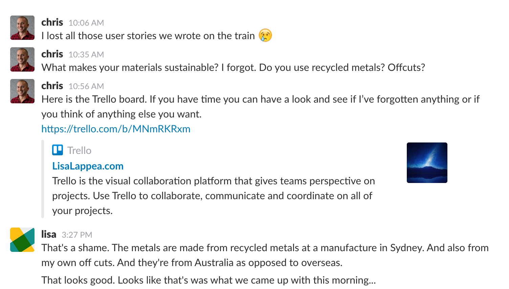

# LisaLappea.com
### *A place to buy and sell unique, sustainable jewellery*

[lisalappea.com on Heroku](https://lisalappea.herokuapp.com/)

## TABLE OF CONTENTS

1. [Problems Being Solved](#problems-being-solved)
1. [Workflow Diagram](#workflow-diagram)
1. [Wireframes](#wireframes)
1. [User Stories](#user-stories)
1. [Entity Relationship Diagram](#entity-relationship-diagram)
1. [Project Plan And Estimation](#project-plan-and-estimation)
1. [Tools And Methodologies](#tools-and-methodologies)
   1. [Trello](#trello)
   1. [Slack](#slack)
   1. [GitHub](#github)
   1. [RuboCop](#rubocop)

### Problems Being Solved
My client is a jewellery maker who sells her jewellery online. She has encountered several pain points:
- Initaially listing her products on third-party sites such as [Etsy](https://www.etsy.com/au/c/jewelry?ref=catnav-1179), she found there to be complete over-saturation of the market. It was very hard to get exposure on these platforms.
- My client was heavily involved in her local artist scene and discovered that many potential customers where interested in purchasing items created locally to themselves. This was hard to do on the larger sites.
- She also found a growing interest in sustainable goods. These were even harder to find on the large sites.
- Deciding to create her own website, she used some 'build-your-own' hosting services such at [Squarespace](https://www.squarespace.com/), [Shopify](https://www.shopify.com.au/) and [Weebly](https://www.weebly.com/au). These services were found to be expensive, lacking custom features and still difficult for non-technical people to set up the wy they wanted.

To solve these pain points, my client decided to enlist my services to build a custom site to her specifications. The site is to be a platform where a curated selection of local artist can sell their creating to a discerning group of customers interested in sustainable, handmade crafts.

### Workflow Diagram
A complete workflow diagram was created using [Sketch](https://www.sketchapp.com/). This diagram was invaluable in the early stages of the disign process. Using it I ensured that every feature required for the site was acccounted for, and that there was a sensible flow around the site.

Unfortunately, due to a disastarous file management oversight, this workflow diagram was lost when a git branch was deleted and cleaned. The below screen shot is all that remains.

### Wireframes
Useing the above workflow diagrarm, I started working on the wireframes for the site. As I knew that the client would ultimately be having a loarge input into the design of the site, I triend to keep the wireframes simple and minimal.

The Sketch project file can be found [here](docs/lisalappea_wireframes.sketch).

### User Stories
Working closely with the client I was able to develop a large list of the features required for the first implementation of the site to go live. Using this list I wrote the following user stories. These stories were used as the basis for all feature sprints.

**These user stories can all be found on the [Trello board](https://trello.com/b/MNmRKRxm).**

- As a jewellery maker, I want to be able to list my products on a website in order to sell them.
- As a jewellery seller, I want to be notified when I make a sale, so I can quickly respond and ship the item.
- As a jewellery buyer, I want to be able to communicate with sellers in order to ask questions about items.
- As a jewellery buyer, I want to be able to save items to a wishlist so that I can access them again easily.
- As a jewellery seller, I want to be able to communicate with users via email, in order to let them know about new items and specials.
- As a jewellery buyer, I want to be able to sort and search through the items, in order to find what I want easier.
- As a jewellery seller, I want to be able to categorise my listings in order to better organise them and make them easier to browse through.
- As a jewellery seller, I want to be able to upload photos of my items in order to show them to users.
- As a jewellery seller, I want to have a profile with contact details and links to my social media, so that I can gain followers and communicate with them.
- As a site admin, I want to be able to add news posts, in order to keep users informed about changes.
- As a jewellery buyer, I want to receive email receipts of purchases in order to track my purchases.
- As a jewellery seller I want to be able to add options to items, in order to offer buyers different materials etc.
- As a jewellery seller, I want to be able to see information about my items, in order to track sales and views.
- As a jewellery buyer, I want access to multiple payment options, so that I won't feel restricted in my options.
- As a jewellery seller, I want add descriptions of my items so I can inform buyers of materials, size, care instructions etc.
- As a jewellery seller I want to be able to offer discount codes in order to promote my products.

### Entity Relationship Diagram
With the user stories and the workflow diagram I wa able to design the database tables and relationships for the site. I used the online tool [DbDesigner](http://dbdesigner.net/) to visualise the structure of the database.

### Project Plan And Estimation

This project had a very tight deadline of about 12 days. Below is the initial time budget I designed for the project.

Activity | Time Budget
---------|------------
Pain Points / User stories | 1 day
Workflow Diagram | 1.5 days
Wireframes | 1.5 days
Entity Relationship Diagram | 1 day
**Planning Phase Total** | **5 days**
Rails project scaffolding | 1 day
Bootstrap/Devise setup | 1 day
Database seeding | 0.5 days
Basic styling | 0.5 days
Payment API Configuration | 1 day
Additional APIs | 2 days
Testing and Review | 1 day
**Build Phase Total** | **7 days**

The planning phase went by without a hitch. The hardest decision I had to mmake was which wireframing and prototyping software to use. I had used [Figma](https://www.figma.com) on previous projects but decided to go with [Sketch](https://www.sketchapp.com/) do get experience with what seems to be the industry standard software. I was very happy with my choice and will probably stick with Sketch for future projects.

Moving on to the build phase of the project, the first day or so went smoothly. As I had spent a large amount of time planning and had a detailed ERD and workflow diagram, the initial Rails project setup of scaffolding and routing was failry straightforward. I identified many issues in the planning phase that were easily worked out that would have caused serious issues if not discovered until the build phase.

Moving farther aloing in the build process I encoutered issues that I had not forseen. The major one being the shopping cart implementation. During planning I had identified a shopping cart system as being critical to the MVP, but had not thought about how exactly it would be implemented. This turned into a major hurdle as I knew it was a critical feature and the project could not move forward without it. Initially I tried to implement the cart completely in Ruy and Rails, but was unable to get it to work. I then spent some time researching common solutions and discovered [Spree](https://spreecommerce.com/), a gem that implements an entire ecommerce solution. I found that Spree was a very popular solution for this problem and I went about integrating it in to the project.

The Spree integration took far longer than I had thought it would. I did learn a lot about third party gem integration, including how to remove gems and reconfigure your application. In the end, I managed to install Spree into the project. Once spree was installed I started looking through the code and realised it would take me days, maybe an entire week, to configure it into somehting usable for the site. Being days behind my schedule already I decided to scrap the Spree gem and revert the project.

During this process of removing Spree and reverting the repository I made a few major mistakes in my handling of git branches and lost a not insignificant amount of my work. Needless to say, they are not mistakes that I will make again. Hopefully.

After moving away from the Spree option I discovered [this tutorial](https://richonrails.com/articles/building-a-shopping-cart-in-ruby-on-rails) on implementing a shopping cart in Rails with just a small amount of AJAX. This shopping cart system was finally implemented, but at this stage the project was hugely behind its already cramped schedule and I was not able to implement many of the other features I had planned.

As this is an actual product that will eventually be deployed, I will continue to work on it using the Trello board to manage priorities.

During this project I learned a great deal about Ruby on Rails and am confident that I will be able to get projects up and running a lot quicker in the future.

### Tools And Methodologies

#### Trello
[Trello board](https://trello.com/b/MNmRKRxm)
I used Trello extensively throughout this project. I find it an invaluable tool for keeping track of what needs to be done and breaking problems down into little pieces that can easily be worked on. I implemented a simple task classifying system where I ranked tasks on their difficulty out of four, and labelled them green through red. Inexperience, however, can lead to misjudging the complexitites of tasks.

In the future I will also add a system for classifying the priority of tasks, as this is something I found lacking during the project.

#### Slack

I created a Slack team with my client and frequently communicated about the project there. It is a great tool for communication and supports links of many different types. I will continue to use Slack for this and future projects.

#### GitHub

Although I made some disastarous mistakes in my management of this project's Git repository, I did learn a great deal and feel that I have developed a much stronger Git workflow. In the future I hope to employ an even stronger technique to my projects.

#### RuboCop

I have been using the Ruby linting tool RuboCop for a while now and I find it invaluable. It uses the Ruby Community Styleguide to analyze your code and offer suggestions for improvement. While it sometimes feels a little heavy-handed, as a programming student I find it an invaluable tool the helps me be mindful of the quality of the code I am writing, as I am writing it.
